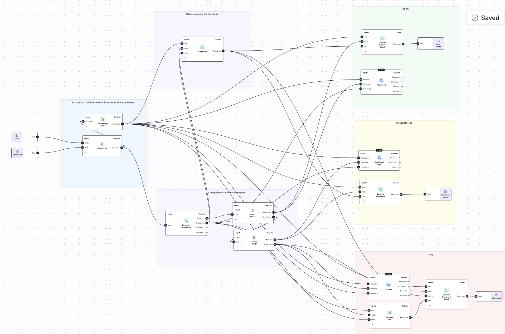

# Lusotech SQE Automation: Noxus Hiring Challenge

> AI-powered supplier quality pipeline built on the Noxus platform to implement an efficient solution to enable Lusotech to handle incoming lot validation automatically.


## Demo

**Cert no. AC/CoA/998773**

https://github.com/user-attachments/assets/a6b870e1-ea84-4298-9fea-c7e49d9ebe5d

**Cert no. AC/CoA/998772**

https://github.com/user-attachments/assets/9d6e034c-005f-4d90-9174-67b3bcbe2530

## What Was Built

| Component | Description |
|---|---|
| **SQE Pipeline** | End-to-end workflow: email ingestion → CoA extraction → validation → routing → notifications → DB insert |
| **Query Agent** | Noxus agent for querying lot/NCR/supplier data with guardrails and visual artifacts |
| **Migration Script** | CLI tool to migrate the workflow from staging to a target workspace |


## Setup

### Prerequisites
- Python 3.10+
- A Noxus workspace 

### Install

```bash
git clone <repo>
cd <repo>
python -m venv venv
source venv/bin/activate  # Windows: venv\Scripts\activate
pip install -r requirements.txt
```

### Configure

Create a `.env` file in the root:

```env
NOXUS_API_KEY=your_noxus_api_key
SUPABASE_URL=https://your-project.supabase.co
SUPABASE_KEY=your_supabase_anon_key
```


## Running the Pipeline

```bash
# Build and deploy the SQE workflow to your Noxus workspace
python main.py --api-key YOUR_NOXUS_API_KEY
```
Then open your Noxus workspace, find **"SQE Pipeline"**, and run it manually inputting the sample email and CoA inputs provided.


## Running the Query Agent

```bash
python agent/agent.py
```

Then open the agent in your Noxus workspace and ask questions.

## Migration Script

Exports the SQE workflow from staging and imports it into a target workspace.

```bash
# Full migration (staging → production)
python migrate.py --target-api-key TARGET_WORKSPACE_KEY

# Overwrite if workflow already exists in target
python migrate.py --target-api-key TARGET_WORKSPACE_KEY --overwrite
```

The source workspace and workflow ID are hardcoded in `migrate.py`. Command line arguments only requires target API key.


## Project Structure

- main.py — Builds and deploys the SQE workflow
- migrate.py — Migration CLI
- config.py — Env config loader
- agent/agent.py — Query agent builder
- workflow/extract.py — CoA extraction node
- workflow/decide.py — Routing and categorisation nodes
- workflow/act.py — Email, DB insert, NCR draft nodes
- prompts/extract.txt — Extraction prompt
- prompts/router.txt — Validation rules prompt

## Design Decisions/Assumptions

**One email at a time**
The pipeline is manually triggered with a single email body and attachment as inputs. Each CoA is processed individually — it may be possible the Noxus platform supports iterating over multiple attachments but this was not found during development, and would be something to explore further. In production a loop or fan-out pattern at ingestion would be the ideal approach.


**Attachment ingested as plain text**
The CoA attachment is passed into the workflow as extracted text rather than a raw document. The DocumentQA node was explored for PDF ingestion but did not produce structured, predictable extraction output consistently enough to feed reliably into the validation step. Passing the attachment as pre-extracted text gave stable, well-formed JSON every time.


**DB insert extended to all verdicts**
The requirements specified database inserts for passing CoAs only. This was extended to cover PASS, CONDITIONAL, and FAIL verdicts so every lot is traceable and queryable regardless of outcome. This makes the query agent significantly more useful for the SQE team — they can filter by verdict, supplier, date range, and failed checks across the full history.


**Output nodes instead of live email**
The notification emails are written to workflow output nodes rather than sent via a real email integration. This was due to not having live credentials for an email provider. In production these would connect directly to an SMTP integration or a service like Resend.


**Agent URL construction**
Rather than using an LLM node to construct full Supabase REST URLs (which proved unreliable in testing), the base URL is hardcoded in the API node and the agent is instructed to supply only the table name and query string. This removes an entire failure point and produces consistent results.


**ERP and PO flags represented as database fields**
The spec defines three actions on verdict: write to ERP, block PO acceptance, and notify warehouse. Without access to a live ERP or PO system, these are represented as boolean fields on the lots table — erp_receipt_posted and po_acceptance_blocked — which are set automatically based on verdict. In a real integration these flags would trigger actual ERP transactions and procurement system updates.


**Row Level Security disabled on Supabase**
RLS (Row Level Security) has been disabled on the Supabase tables to allow the workflow API nodes to read and write without authentication friction during development. This would never be acceptable in production, in a real deployment RLS policies would be enabled and the workflow would authenticate using a service role key scoped to only the operations it needs.


## Database Schema

Three tables underpin the pipeline. All inserts are handled via a Supabase Edge Function.

**suppliers**
| Column | Type | Notes |
|---|---|---|
| id | uuid | Primary key |
| name | text | Unique supplier name |
| plant_address | text | |
| phone | text | |
| email | text | |
| vat_number | text | |
| iso_9001 | boolean | Certification flag |
| iatf_16949 | boolean | Certification flag |
| is_approved | boolean | Approved vendor flag |
| approved_at | timestamptz | |
| approved_by | text | |

**ncr_drafts**
| Column | Type | Notes |
|---|---|---|
| id | uuid | Primary key |
| lot_id | uuid | References lots |
| supplier_id | uuid | References suppliers |
| fail_reasons | jsonb | List of failed checks |
| status | ncr_status | draft / confirmed |
| assigned_to | text | SQE engineer |
| resolution | ncr_resolution | pending / accepted / rejected |
| resolution_notes | text | |
| closed_at | timestamptz | |
| closed_by | text | |

**lots**
| Column | Type | Notes |
|---|---|---|
| id | uuid | Primary key |
| coil_lot_id | text | Unique lot identifier |
| cert_number | text | CoA certificate number |
| po_reference | text | Purchase order ref |
| supplier_name | text | As extracted from CoA |
| supplier_id | uuid | References suppliers — not yet populated by workflow |
| ncr_id | uuid | References ncr_drafts — set on FAIL |
| carbon_c_pct | numeric | Chemical composition |
| manganese_mn_pct | numeric | Chemical composition |
| phosphorus_p_pct | numeric | Chemical composition |
| sulphur_s_pct | numeric | Chemical composition |
| titanium_ti_pct | numeric | Chemical composition |
| yield_strength_re_mpa | numeric | Mechanical property |
| tensile_strength_rm_mpa | numeric | Mechanical property |
| elongation_a80_pct | numeric | Mechanical property |
| plastic_strain_ratio_r90 | numeric | Mechanical property |
| strain_hardening_exp_n90 | numeric | Mechanical property |
| hardness_hrb | numeric | Mechanical property |
| thickness_mm | numeric | Dimensional |
| width_mm | numeric | Dimensional |
| verdict | text | PASS / CONDITIONAL / FAIL |
| verdict_reasoning | text | Full rationale from router |
| failed_checks | jsonb | List of violated rules |
| status | lot_status | pending / released / held / quarantined |
| erp_receipt_posted | boolean | ERP flag |
| po_acceptance_blocked | boolean | PO block flag |


## Workflow Overview





**SQE Pipeline Workflow**
The pipeline is triggered manually with two inputs — the supplier email body and the CoA attachment as extracted text. It runs left to right across three stages.

**Extract**
The email body and attachment are passed into a TextGenerationNode which extracts all mandatory and optional CoA fields into a structured JSON object — supplier name, PO reference, heat number, lot ID, material grade, chemical composition, and mechanical test results. A passthrough node then re-emits the JSON cleanly to fan out to multiple downstream nodes without interpolation issues.

**Decide**
The extracted JSON is passed to an EnsembleCategorizerNode which validates every field against the Lusotech DC04 spec (LSQ-SPEC-DC04-r3) and assigns a verdict of PASS, CONDITIONAL, or FAIL with full reasoning. Two chained ComplexConditionalNodes then route the flow to the correct branch — PASS if all values are within tolerance, CONDITIONAL if exactly one non-critical property deviates by no more than 2%, FAIL if any critical property is out of spec or any mandatory field is missing.

**Act**
Each branch runs three things in parallel — a database insert via Supabase Edge Function setting the correct lot status (released, held, or quarantined), an email notification generated for the relevant team, and on FAIL an NCR draft is generated before the email. All three branches write to an OutputNode so the result is visible in the Noxus workspace.


## What's Missing / Noxus Feedback

See [`NOTES.md`](./NOTES.md) for specific gaps found during this build — missing SDK methods, node limitations, and production-grade features that would be needed at scale.

## Sample Verdicts

| CoA | Verdict | Reason |
|---|---|---|
| Acerlux_CoA_998772 | **PASS** | All mandatory fields present, all chemical and mechanical values within spec |
| Acerlux_CoA_998773 | **CONDITIONAL** | Re_MPa = 215, exceeds upper limit of 210 by 2.4% — single critical deviation |


## Extensions/If I Had More Time

**Reasoning field causes Supabase insert failures**

- The verdict reasoning generated by the router node is a multi-line block of text that can contain newlines, apostrophes, and parentheses. When this is interpolated directly into the JSON body string in the API node it breaks the JSON structure before it reaches the Edge Function, causing the insert to fail. This was identified by testing with a short single-line value — "100%" — which inserted successfully, confirming the reasoning text itself was the problem rather than the extracted data or schema. Sanitisation of the request body was attempted but did not fully resolve the issue — this remains an open bug that would need further investigation.
  
**Loop over multiple attachments**
- The pipeline currently processes one CoA at a time. The sample email contains two attachments, and in production Lusotech receives 200-500 lots per week, often batched per email. A native iterator or fan-out pattern would allow a single email trigger to spawn one pipeline run per attachment automatically. Noxus does not currently have a loop node — this is the biggest architectural gap for production scale. I also recognise the current workflow structure reflects a steep learning curve with the platform and there are likely more efficient patterns I would refactor with more time.

**Approved supplier validation**
- A suppliers table exists in the database as a registry of approved vendors. The lots table should reference this on insert, and the pipeline should alert the SQE team if a CoA is received from a supplier not on the approved list — catching rogue or unapproved sources before the lot enters the release flow.
  
**Store NCR drafts in the database**
- The lots table already references the NCR table in the schema, but right now the drafted NCR only exists in the notification email — it is never written to the database. Given more time, the FAIL branch would insert the NCR draft into the ncr_drafts table automatically, linked to the lot by ID. This would mean every failed lot has a traceable, queryable NCR record from the moment it is flagged, rather than living only in an email inbox.

## Author

Hannah Ishimwe


